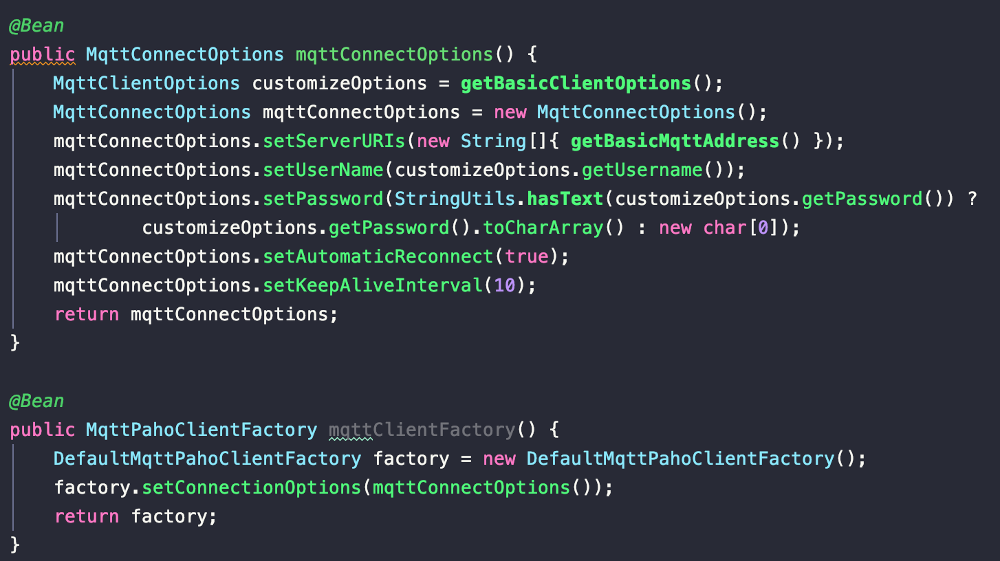
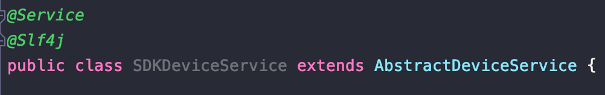
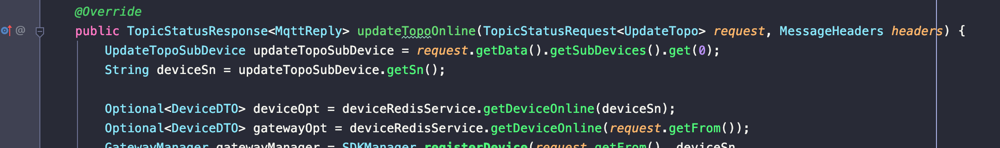
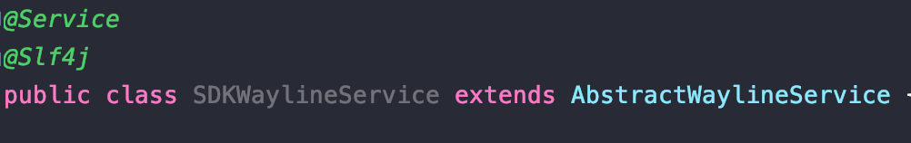
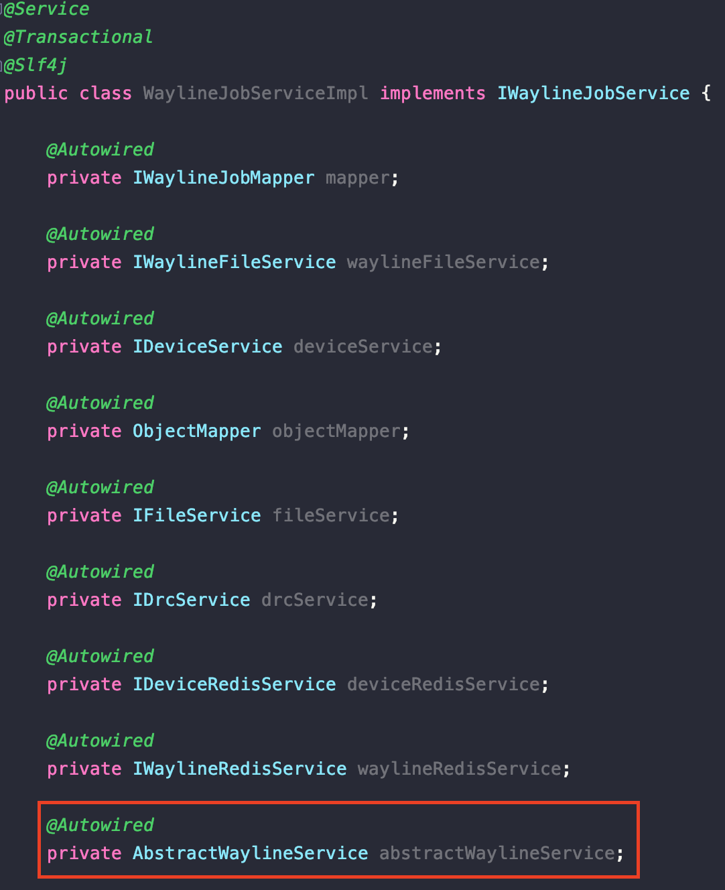
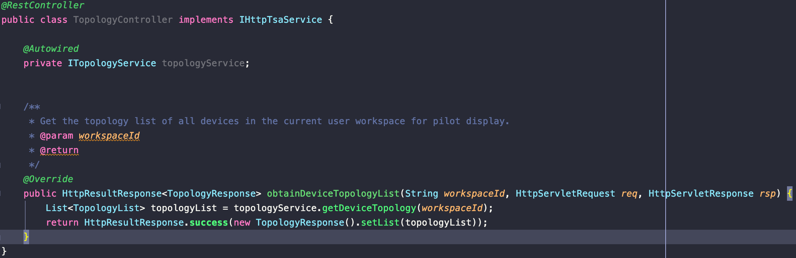

# 如何接入CloudSDK
### 1. 在组件扫描中增加包名：com.dji.sdk
### [2. 连接MQTT](#如何连接MQTT)
### [3. 实现SDK 的方法](#如何实现SDK的方法)
### [4. 调用SDK 的方法](#如何调用SDK的方法)

## 如何连接MQTT
- 在spring容器中注入MqttConnectOptions和MqttPahoClientFactory；  
  

- 在application.yml中配置cloud-sdk.mqtt.inbound-topic，未配置则不进行初始化订阅。

## 如何实现SDK的方法
 - 定义一个类，继承com.dji.sdk.cloudapi.*.api包中的抽象类；
 - 重写具体的方法以实现功能；
 - 将定义的类放入spring容器中，由spring管理bean的生命周期。
### 【设备上线】示例：
 - 定义一个类：SDKDeviceService 继承AbstractDeviceService；  

 - 重写方法updateTopoOnline，实现设备上线功能。  

## 如何调用SDK的方法
 - 定义一个类，继承com.dji.sdk.cloudapi.*.api包中的抽象类；
 - 在需要调用的类中注入该类；
 - 调用具体的方法。
### 【航线预下发命令】示例：
 - 定义一个类：SDKWaylineService 继承 AbstractWaylineService；  

 - 在WaylineJobServiceImpl中注入该类；  

 - 调用下发命令的方法：  

## 如何实现CloudAPI 定义的http 接口
 - 定义一个类，实现com.dji.sdk.cloudapi.*.api包中的http接口类；
 - 重写具体的方法以实现接口，无需定义请求地址和方法等数据。  
 
 
## 如何查看CloudAPI 定义的所有http 接口
 - 启动程序
 - 浏览器打开：http://localhost:6789/swagger-ui/index.html

## 如何接入WebSocket
 - CloudSDK 已经定义了WebSocket服务，但是没有实现WebSocket管理。默认地址为：http://localhost:6789/api/v1/ws 
 - 自定义接入参考：com.dji.sample.component.websocket.config